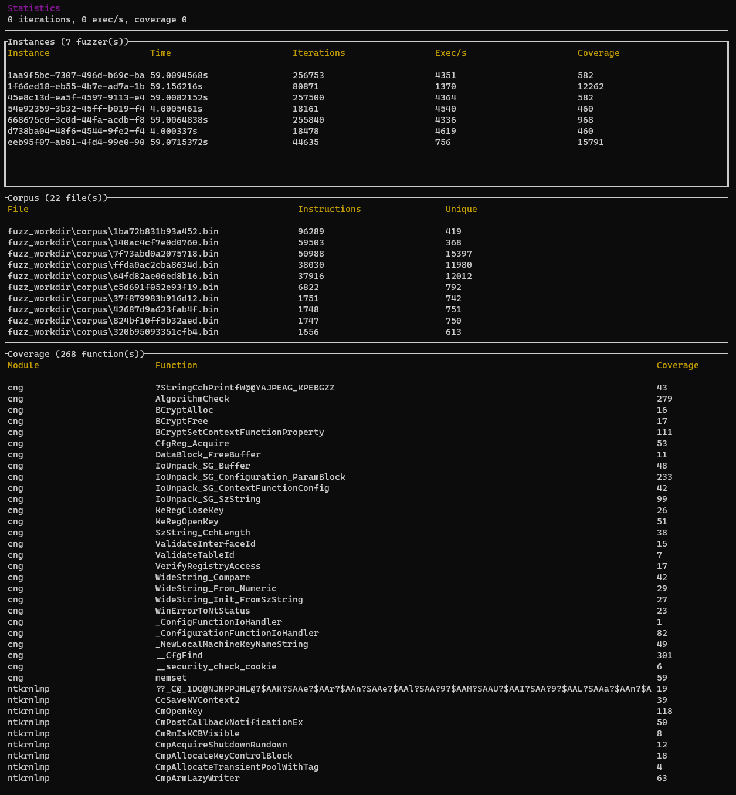

# README

Rewind is a snapshot-based coverage-guided fuzzer targeting
Windows kernel components.

The idea is to start from a snapshot of a live running system. This
snapshot is composed of the physical memory pages along with the state
of the cpu.

This state is used to setup the initial state of a virtual cpu. By leveraging on-demand
paging only the pages needed for the execution of the target function are read from the snapshot.

Because we use a dedicated virtual machine with only the physical memory pages useful for the execution of the target function, restoring a snapshot is fast.

As of now 2 backends are available:

-  ``WHVP`` backend leverages WHVP (Windows Hypervisor Platform) API to
   provide access to a Hyper-V partition. See
   https://docs.microsoft.com/en-us/virtualization/api/hypervisor-platform/hypervisor-platform
   for more details.
-  ``Bochs`` backend leverages the Bochs emulator
   (https://bochs.sourceforge.io/)

A `KVM` backend is being developed and should be available soon.

Rewind provides 2 main features:
- the ability to trace an arbitrary function
- the ability to fuzz an arbitrary function

It also provides a basic TUI (Terminal User Interface) to report useful information regarding the fuzzing.

It has been tested on Windows and Linux (only bochs backend for linux for now).

## Motivation

I always enjoyed doing kernel vulnerability research specially on Windows kernel. The process
always involve a mix of static and dynamic analysis. Doing dynamic analysis can quickly become
tedious. The cycle debug / crash / reboot / reset all breakpoints is slow and painful. When you
want to do some fuzzing, it often requires you to setup one or several virtual machines plus a
kernel debugger and craft some ghetto scripts to handle crash detection...

Doing snapshot with virtual machines helps but it's slow.

During 2018, Microsoft introduced a new set of API named Windows Hypervisor Platform (WHVP). These
API allow to setup a partition (VM in hyper-V lingua) with some virtual processors and to have a
control on the VM exits occurring in the virtual machine. It's almost like having your own
VM-exit handler in userland. Quite handy to do useful things, for example
[Simpleator](https://github.com/ionescu007/Simpleator)
or [applepie](https://github.com/gamozolabs/applepie).

So I started to play with WHVP and made a first PoC allowing me to execute
in a Hyper-V partition some shellcode. It was written in Python and quite slow. This first PoC
evolved quite quickly to some kind of snapshot-based tracer. I wanted to have something to
bootstrap the virtual CPU and quite easy to setup. So since I was already using a kernel debugger
to play with my target, I decided to use kernel dumps made with WinDbg as my snapshot. With that I just
needed to setup a partition with a virtual cpu. The virtual cpu context is set with the context
taken from the dump. Whenever the virtual cpu needs a physical page I use the ones from the dump.

With this I was able to fork the state of the dump into a partition and then resume execution. 
It allowed me to easily trace the execution of my target function. By modifying the arguments and
reverting the memory state of the partition it was also really easy to fuzz the target.

This work was presented at SSTIC conference in [2020](https://www.sstic.org/2020/presentation/fuzz_and_profit_with_whvp/) and
released on [github](https://github.com/quarkslab/whvp).

The tool implements 2 possibilities to obtain the coverage. The first one leverages the classical TF (Trap Flag) to have INT1 interruptions on every instruction. 
It requires to modify the target and it's slow. I would have preferred to use [MONITOR](http://hypervsir.blogspot.com/2014/11/monitor-trap-flag-mtf-usage-in-ept.html) trap flag. But WHVP doesn't offer this possibility.

In order to have proper performances (required for fuzzing), I decided to reduce the precision of
the coverage and add a mode when you only know when an instruction is executed for the first time.

To do that I patch the pages fetched from the snapshot with 0xcc bytes (only for executable pages).
When the cpu will execute these patched instructions the hypervisor will trap the exception and
rewrite the instructions with the original code.

It's like having a unique software breakpoint set on every instruction. It works 95% of the time but
in particular piece of code (ones with jump tables for example) it will fail because data will be
replaced.

To overcome this one option would be to disassemble the code before mapping it and only patch what
is needed (maybe next time).

During my experiment I encountered several limitations when using WHVP. It's slow, like really slow.
[VirtualBox](https://www.virtualbox.org/browser/vbox/trunk/src/VBox/VMM/VMMR3/NEMR3Native-win.cpp)
source code have some interesting comments :)

So to have proper performance you really need to limit VM exits and it's incompatible if you want to
use Hyper-V as a tracing hypervisor (since it requires a lot of VM exits).

During the same time I started to use
[bochs](https://bochs.sourceforge.io/cgi-bin/lxr/source/instrument/instrumentation.txt) (specially
the instrumentation part) to check if the traces obtained by the tool were correct. Bochs was some
kind of oracle to see if I had divergent traces.

Bochs is faster than WHVP when doing full trace and you also have the benefits of having memory accesses plus other useful goodies.

I decided to add bochs as another backend. ``whvp`` was not a proper name anymore and I settled on ``rewind``.



## Typical usage

``rewind`` was designed around my own workflow when I’m conducting
security assessments for kernel drivers on Windows platform.

The first step is to install the target software inside a virtual
machine. Since I’m using a mix of static and dynamic analysis I will
also setup a kernel debugger.

After having opened some random drivers in IDA, I’ll quickly begin to
target some functions. To do that I usually put some breakpoints with
``windbg`` and combined with [ret-sync](https://github.com/bootleg/ret-sync)
I can start to play.

That’s where ``rewind`` comes into play. Instead of editing random
buffer in memory and singlestep and annotate the IDB to have a rough
idea of what’s is going on. I’ll take a snapshot with ``windbg`` and use
``rewind`` instead.

It will ease the process a lot. Having a snapshot offers a lot of
advantages. Everything is deterministic. You can replay ad nauseum a
function call. You can launch a fuzzer if the target function looks
interesting. You can even close the VM since it’s not needed anymore.

## Prerequisites

Obviously you need Rust (installation tested on Windows and Linux with Rust 1.50). CMake is also
needed by some dependencies.

## Git

First clone the repository:

```
$ git clone git@github.com:quarkslab/rewind.git
```

Continue with the installation of bochs backend

### Bochs

Clone bochscpu (https://github.com/yrp604/bochscpu) repository in the ``vendor`` directory:

```
$ cd vendor
$ git clone https://github.com/yrp604/bochscpu
```

Download the prebuilt bochs artifacts from bochscpu-build (https://github.com/yrp604/bochscpu-build)

```
$ curl.exe -L --output bochs-x64-win.zip [artifact_url]
```

Extract the ``lib`` and ``bochs`` folders into the bochscpu checkout.

```
$ Expand-Archive -Path .\bochs-x64-win.zip -DestinationPath .\
$ copy -Recurse .\bochs-x64-win\msvc\* .\bochscpu\
```

### WHVP

On Windows WHVP will also be built as backend. 

In a elevated powershell session, use the following command to check if WHVP is enabled:

```
Get-WindowsOptionalFeature -FeatureName HypervisorPlatform -Online

FeatureName      : HypervisorPlatform
DisplayName      : Windows Hypervisor Platform
Description      : Enables virtualization software to run on the Windows hypervisor
RestartRequired  : Possible
State            : Enabled
CustomProperties :
```

If it is not enabled you can use `Set-WindowsOptionalFeature` cmdlet to enable. You'll also need to enable Hyper-V.

You also need to have a Windows SDK (10.0.19041.0) installed. You can download it from https://developer.microsoft.com/fr-fr/windows/downloads/windows-10-sdk/.


### Build from master branch

You need to install LLVM and set the `LIBCLANG_PATH` environment variable (required by `bindgen`)
See https://rust-lang.github.io/rust-bindgen/requirements.html for a detailed explanation.

```
$ $env:LIBCLANG_PATH="C:\Program Files\LLVM\bin"
```

From there you should be able to build ``rewind`` (nightly required because of ``unwind_attributes`` in ``bochscpu`` crate):

```
$ cd rewind_cli
$ cargo +nightly build --release
```

``rewind`` binary will be available in the ``target/release`` directory.

You could also use cargo to install locally:

```
$ cd rewind_cli
$ cargo +nightly install --path .
```

### Common build issues

-  if cmake is not in path, you will have an error when building zydis

```
> error: failed to run custom build command for `zydis v3.1.1`
```

- if Windows SDK is different of the supported ones, `whvp-sys` will fail to build


## Examples

A basic tutorial leveraging CVE-2020-17087 is provided in the [examples](/examples/CVE-2020-17087) directory

## Roadmap

See [TODO.md](/TODO.md)

## Known Bugs/Limitations

- This software is in a very early stage of development and an ongoing experiment.
- Sometimes the tracer is unable to trace the target function (most common issue is invalid virtual cpu state).
- When using `hit` coverage mode, the tracer will misbehave on some functions (it is the case with some switch tables). The reason is that each byte is replaced by software breakpoints (including data if they are present in a executable page). A better way to do that would be to obtain the list of all the basic blocks from a disassembler for example.
- The target function will be executed with a unique virtual processor, you have no support for hardware so it's probable something will be wrong if you trace hardware related functions
- This tool is best used for targetting specific functions
- To have best performances, minimize VM exits and modified pages because they can be really costly and will increase the time needed to execute the function. 
- Don't use hyper-V to do snapshots. Windows Hyper-V are "enlightened" meaning they are using paravirtualization, it's currently not handled
- Some symbols are not resolved properly

## License

This tool is currently developed and sponsored by Quarkslab under the Apache 2.0 license.

## Greetz

Hail to @yrp604, @0vercl0k, Alexandre Gazet for their help, feedbacks and thoughts. Thanks also to all my colleagues at Quarkslab!
