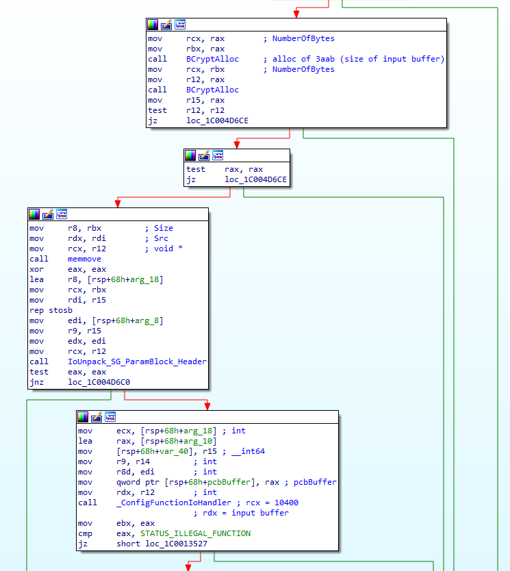
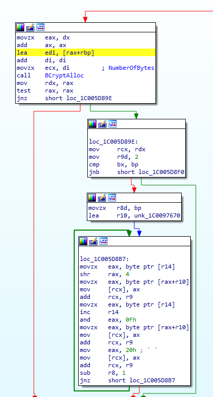
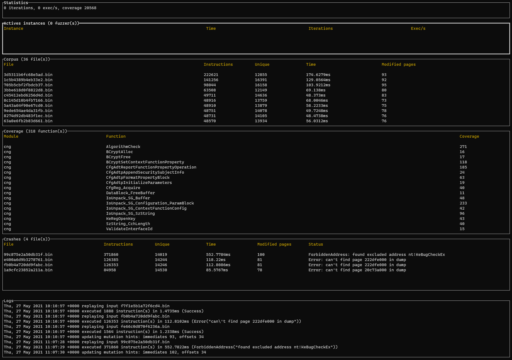

# Rewind vs world: CVE-2020-17087

I decided to check if ``rewind`` was able to find real world vulnerabilities. The main use case of ``rewind`` is to be able to trace or fuzz a function encountered during kernel driver security assessment.
So I need a vulnerability in a driver (in an ioctl would be perfect).

In November 2019, P0 releases some kind of 0-day in ``cng.sys`` (https://bugs.chromium.org/p/project-zero/issues/detail?id=2104)

> The Windows Kernel Cryptography Driver (cng.sys) exposes a \Device\CNG device to user-mode programs and supports a variety of IOCTLs with non-trivial input structures. It constitutes a locally accessible attack surface that can be exploited for privilege escalation (such as sandbox escape).
>
> We have identified a vulnerability in the processing of IOCTL 0x390400, reachable through the following series of calls:
>
> 1. cng!CngDispatch
> 2. cng!CngDeviceControl
> 3. cng!ConfigIoHandler_Safeguarded
> 4. cng!ConfigFunctionIoHandler
> 5. cng!_ConfigurationFunctionIoHandler
> 6. cng!BCryptSetContextFunctionProperty
> 7. cng!CfgAdtReportFunctionPropertyOperation
> 8. cng!CfgAdtpFormatPropertyBlock
>
> The bug resides in the cng!CfgAdtpFormatPropertyBlock function and is caused by a 16-bit integer truncation issue.

Another explanation is available on https://attackerkb.com/topics/y8mmBHc710/cve-2020-17087-windows-kernel-local-privilege-escalation-0day

> An error exists within cng!CfgAdtpFormatPropertyBlock where buffer is allocated from a value that is truncated to be 16-bits. The function then goes on and performs a binary to ASCII hex conversion, writing the ASCII hex characters to this buffer. While performing the conversion, the original buffer’s correct length is used causing the write to continue out of bounds.
>
> The vector for this vulnerability is local. A malicious attacker would first have to have code execution on the target system from any context including that of a sandboxed application. From there they would open a handle to \\.\GLOBALROOT\Device\Cng before issuing the 0x390400 IOCTL with a crafted input buffer. The crafted input buffer contains a size parameter as one of the fields that when set to 0x2aab or greater will trigger the overflow.
>
> Exploitation of this bug won’t be easy due to it being a heap based memory corruption within the kernel’s NonPagedPool. The attacker has partial control over the size of the allocation as constrained by ((size * 6) & 0xffff).

With these descriptions, this vulnerability seems like a good test case!

FIXME: Explain rewind genesis

# Setup

If you don't want to create your own snapshots you can use the ones provided in the [snapshots](/examples/CVE-2020-17087/snapshots) directory (and skip this part).

## Snapshots

These snapshots are composed of several files:

- ``context.json`` contains the initial state of the virtual cpu
- ``params.json`` contains the parameters used by the tracer (to know when to stop execution for example)
- ``mem`` is a directory where physical pages are stored as a file

They only contains the memory pages needed to execute the tutorial (and thus might be not suitable for everything).
Specially when it comes to fuzzing some physical pages may be missing (and thus reported as so by the fuzzer).

### Repro

To reproduce the vulnerability I set up a vulnerable laptop and use the code available in the [cng](/examples/CVE-2020-17087/cng/) directory to reproduce the bug.

```rust
let device = CString::new("\\\\.\\GLOBALROOT\\Device\\Cng").wrap_err("Failed to create cstring")?;
let h_cng = validate_handle(unsafe { 
    CreateFileA(device.as_ptr(),
        GENERIC_READ | GENERIC_WRITE,
        0,
        null_mut(),
        OPEN_EXISTING,
        0,
        null_mut())
}).wrap_err("Failed to open handle to \\\\Device\\Cng")?;

println!("opened \\Device\\Cng, handle: {:?}", h_cng);

let ioctl = 0x390400;

[snip]

println!("will send {:x} bytes to device", input.len());

let status = cvt(unsafe {
    DeviceIoControl(h_cng,
        ioctl,
        input.as_mut_ptr() as *mut _,
        input.len() as u32,
        output.as_mut_ptr() as *mut _,
        output.len() as u32,
        &mut bytes,
        null_mut())
});

println!("sent ioctl, result is {:x}", bytes);
println!("output: {:#x?}", &output);
```

With the inputs provided by P0 (I needed to modify them a bit, they are available in the [inputs](/examples/CVE-2020-17087/inputs/) directory) and a kernel debugger, we can reproduce the vulnerability.

We'll take 2 snapshots.  The first one when the `cng!ConfigIoHandler_Safeguarded` is called. The second one when the `cng!_ConfigurationFunctionIoHandler` is called.

The second call occurs just after some basic checks on the input buffer. We'll use the second snapshot for the fuzzing part because the call happens after the copy of the input buffer to a working buffer. It will improve the performance of the fuzzing.



You can use the following commands in windbg to set up the breakpoints:

```
!reload
bp cng!ConfigIoHandler_safeguarded ".if (@rdx == 0n20000) {} .else {r rdx;g}"
bp cng!_ConfigurationFunctionIoHandler ".if (@rcx == 10400) {} .else {r rcx;g}"
```

Then launch the ``cng`` binary on the target system:

```
$ cng.exe --size 20000
```

The breakpoints should hit in windbg and you can use the [pykd script](/scripts/pykd_dump_context.py) to obtain a snapshot:
(`pykd` should be installed)

```
!load pykd
!py -g -3.7 [path_to_rewind]\Rewind\scripts\pykd_dump_context.py [path_to_snapshot]\snapshots
```

It's also best if you deactivate the swap and use only one cpu on the target system (you can use ``bcdedit /set onecpu on`` if you are not on a virtual machine).

If everything went well you will obtain a kernel memory dump:

```
Loading Dump File [C:\Projets\Rewind\examples\snapshots\19041.1.amd64fre.vb_release.191206-1406\cng\_ConfigurationFunctionIoHandler\mem.dmp]
Kernel Bitmap Dump File: Active memory is available


************* Path validation summary **************
Response                         Time (ms)     Location
Deferred                                       srv*
Symbol search path is: srv*
Executable search path is: 
Windows 10 Kernel Version 19041 UP Free x64
Product: WinNt, suite: TerminalServer SingleUserTS
Edition build lab: 19041.1.amd64fre.vb_release.191206-1406
Machine Name:
Kernel base = 0xfffff804`80400000 PsLoadedModuleList = 0xfffff804`8102a310
Debug session time: Tue Dec  1 16:09:45.766 2020 (UTC + 2:00)
System Uptime: 0 days 0:03:43.461
Loading Kernel Symbols
...............................................................
................................................................
...................................
Loading User Symbols
............
Loading unloaded module list
..........
For analysis of this file, run !analyze -v
cng!_ConfigurationFunctionIoHandler:
fffff804`83037f54 488bc4          mov     rax,rsp

kd> vertarget
Windows 10 Kernel Version 19041 UP Free x64
Product: WinNt, suite: TerminalServer SingleUserTS
Edition build lab: 19041.1.amd64fre.vb_release.191206-1406
Machine Name:
Kernel base = 0xfffff804`80400000 PsLoadedModuleList = 0xfffff804`8102a310
Debug session time: Tue Dec  1 16:09:45.766 2020 (UTC + 2:00)
System Uptime: 0 days 0:03:43.461
```

# Play with trace

See what happens when we run the tracer with the default context:

```
❯ rewind trace run .\snapshots\17763.1.amd64fre.rs5_release.180914-1434\cng\ConfigIoHandler_Safeguarded
:: Running tracer
==> loading snapshot
==> will use bochs backend
==> setting tracer initial state
rax=0000000000000382 rbx=0000000000000000 rcx=ffffe38f3f699000
rdx=0000000000004e20 rsi=ffffe38f3f699000 rdi=ffffde0b7d3417f8
rip=fffff8051b28642c rsp=ffffde0b7d3416d8 rbp=ffffde0b7d341759
 r8=ffffe38f3f699000  r9=ffffde0b7d3417f8 r10=0000fffff8051b28
r11=ffffa67acee00000 r12=00000000c00000bb r13=0000000000390400
r14=0000000000000004 r15=0000000000000000
cs=0010  ss=0018  ds=002b  es=002b  fs=0053  gs=002b  rflags=0246
==> running tracer
==> executed 14172 instruction(s) in 35.3831ms (Success)
==> seen 3177 unique address(es)
==> mapped 130 page(s) (532.48 kB)
==> 45 page(s) were modified
```

We can use another backend (for example ``WHVP``):

```
❯ rewind trace run .\snapshots\17763.1.amd64fre.rs5_release.180914-1434\cng\ConfigIoHandler_Safeguarded --backend whvp
:: Running tracer
==> loading snapshot
==> will use whvp backend
==> setting tracer initial state
rax=0000000000000382 rbx=0000000000000000 rcx=ffffe38f3f699000
rdx=0000000000004e20 rsi=ffffe38f3f699000 rdi=ffffde0b7d3417f8
rip=fffff8051b28642c rsp=ffffde0b7d3416d8 rbp=ffffde0b7d341759
 r8=ffffe38f3f699000  r9=ffffde0b7d3417f8 r10=0000fffff8051b28
r11=ffffa67acee00000 r12=00000000c00000bb r13=0000000000390400
r14=0000000000000004 r15=0000000000000000
cs=0010  ss=0018  ds=002b  es=002b  fs=0053  gs=002b  rflags=0246
==> running tracer
==> executed 1 instruction(s) in 19.8264ms (Success)
==> seen 1 unique address(es)
==> mapped 130 page(s) (532.48 kB)
==> 56 page(s) were modified
```

Since we didn't specify the type of coverage, it didn't trace anything. Changing the type of coverage is only useful for WHVP backend. Since bochs is an emulator you always trace everything (you also obtain useful things like memory accesses).
You can notice that we have some discrepancies between the 2 backends regarding how modified pages are taken into account.  It's also the case for counting executed instructions.

Let's do some singlestepping:

```
❯ rewind trace run .\snapshots\17763.1.amd64fre.rs5_release.180914-1434\cng\ConfigIoHandler_Safeguarded --backend whvp --coverage instrs
:: Running tracer
==> loading snapshot
==> will use whvp backend
==> setting tracer initial state
rax=0000000000000382 rbx=0000000000000000 rcx=ffffe38f3f699000
rdx=0000000000004e20 rsi=ffffe38f3f699000 rdi=ffffde0b7d3417f8
rip=fffff8051b28642c rsp=ffffde0b7d3416d8 rbp=ffffde0b7d341759
 r8=ffffe38f3f699000  r9=ffffde0b7d3417f8 r10=0000fffff8051b28
r11=ffffa67acee00000 r12=00000000c00000bb r13=0000000000390400
r14=0000000000000004 r15=0000000000000000
cs=0010  ss=0018  ds=002b  es=002b  fs=0053  gs=002b  rflags=0246
==> running tracer
setting bp on return address fffff8051b285f5f
==> executed 34174 instruction(s) in 845.9993ms (Success)
==> seen 3176 unique address(es)
==> mapped 130 page(s) (532.48 kB)
==> 56 page(s) were modified
```

In singlestep, TF (Trap Flag) is enabled in ``rflags`` and we'll trap on exception. As a result a VM-exit will occur on every executed instruction.
It is really slow. WHVP backend is not usable to obtain accurate traces.

We can also get the coverage on **new** encountered instructions. When executable pages are fetched from the snapshot, they are replaced with ``0xcc``. 
When the virtual cpu will execute an instruction, an exception will occur and be trapped by the hypervisor. We replace the ``0xcc`` with the original instruction read from the snapshot and resume execution.
As a result we can gather the number of **unique** executed addresses.

```
❯ rewind trace run .\snapshots\17763.1.amd64fre.rs5_release.180914-1434\cng\ConfigIoHandler_Safeguarded --backend whvp --coverage hit
:: Running tracer
==> loading snapshot
==> will use whvp backend
==> setting tracer initial state
rax=0000000000000382 rbx=0000000000000000 rcx=ffffe38f3f699000
rdx=0000000000004e20 rsi=ffffe38f3f699000 rdi=ffffde0b7d3417f8
rip=fffff8051b28642c rsp=ffffde0b7d3416d8 rbp=ffffde0b7d341759
 r8=ffffe38f3f699000  r9=ffffde0b7d3417f8 r10=0000fffff8051b28
r11=ffffa67acee00000 r12=00000000c00000bb r13=0000000000390400
r14=0000000000000004 r15=0000000000000000
cs=0010  ss=0018  ds=002b  es=002b  fs=0053  gs=002b  rflags=0246
==> running tracer
==> executed 3176 instruction(s) in 771.0458ms (Success)
==> seen 3176 unique address(es)
==> mapped 130 page(s) (532.48 kB)
==> 56 page(s) were modified
```

Let's try to execute the vulnerable function with the input highlighted in the Google P0 report.
The input buffer is located in the ``rcx`` register and the input buffer size in ``rdx``.

```
❯ rewind trace run .\snapshots\17763.1.amd64fre.rs5_release.180914-1434\cng\ConfigIoHandler_Safeguarded --backend bochs --input-address ffffe38f3f699000 --input-data .\inputs\P0_repro.bin
:: Running tracer
==> loading snapshot
==> will use bochs backend
==> setting tracer initial state
rax=0000000000000382 rbx=0000000000000000 rcx=ffffe38f3f699000
rdx=0000000000004e20 rsi=ffffe38f3f699000 rdi=ffffde0b7d3417f8
rip=fffff8051b28642c rsp=ffffde0b7d3416d8 rbp=ffffde0b7d341759
 r8=ffffe38f3f699000  r9=ffffde0b7d3417f8 r10=0000fffff8051b28
r11=ffffa67acee00000 r12=00000000c00000bb r13=0000000000390400
r14=0000000000000004 r15=0000000000000000
cs=0010  ss=0018  ds=002b  es=002b  fs=0053  gs=002b  rflags=0246
==> replaying input ".\\inputs\\P0_repro.bin"
==> writing input to ffffe38f3f699000
==> running tracer
==> executed 294269 instruction(s) in 269.7622ms (ForbiddenAddress("found excluded address nt!KeBugCheckEx"))
==> seen 14095 unique address(es)
==> mapped 411 page(s) (1.68 MB)
==> 108 page(s) were modified
```

The execution was stopped because we executed one of the forbidden functions (``KeBugCheckEx`` in this case).
These addresses are provided in the ``params.json`` file.

```
❯ cat .\snapshots\17763.1.amd64fre.rs5_release.180914-1434\cng\ConfigIoHandler_Safeguarded\params.json
{
  "return_address": 18446735299546996575,
  "excluded_addresses": {
    "nt!KeBugCheck": 18446735299530010320,
    "nt!KeBugCheck2": 18446735299530909984,
    "nt!KeBugCheckEx": 18446735299530010352
  }
}
```

Let's save the trace in order to understand what's going on:

```
❯ rewind trace run .\snapshots\17763.1.amd64fre.rs5_release.180914-1434\cng\ConfigIoHandler_Safeguarded --backend bochs --input-address ffffe38f3f699000 --input-data .\inputs\P0_repro.bin --save-trace trace.json --save-context
...
==> saving trace to trace.json
```

The executed addresses (plus the processor context) are serialized to a JSON file.

To ease with reversing and symbols, a local store is used.
This store is used to download binaries and symbols (if they are present on MS symbol server).

```
❯ tree store
store
├── binaries
│   ├── cng.sys
│   │   ├── 2482C10CB7000
│   │   │   └── cng.sys
│   │   └── A7D172D6B7000
│   │       ├── cng.sys
│   ├── hal.dll
│   │   └── F8B4C72E9C000
│   │       └── hal.dll
│   └── ntoskrnl.exe
│       ├── 6105701FA71000
│       │   ├── ntoskrnl.exe
│       └── 90EE290B1046000
│           └── ntoskrnl.exe
└── symbols
    ├── cng.pdb
    │   ├── 48859d06bf92471e702abbc952f1c8ec1
    │   │   └── cng.pdb
    │   └── 86b63eb98ed873ddcb7654ac95c8c3ed1
    │       └── cng.pdb
    ├── hal.pdb
    │   └── 807db9487e66a225f419f924f4f06eaf1
    │       └── hal.pdb
    └── ntkrnlmp.pdb
        ├── 20c711bbd4c21aa5c45bc774bc7e04721
        │   └── ntkrnlmp.pdb
        └── b16053724b46515388fdea9d0470d02e1
            └── ntkrnlmp.pdb

18 directories, 17 files
```

Let's convert this trace to a more human friendly format.
To do this we need to specify the snapshot, the trace and a store. 

```
❯ rewind trace inspect --snapshot .\snapshots\17763.1.amd64fre.rs5_release.180914-1434\cng\ConfigIoHandler_Safeguarded --trace .\trace.json --store .\store\ --show-coverage
:: Inspecting trace
==> loading snapshot
==> loading trace
==> trace contains 294269 instructions

:: Analysing trace
==> loading modules
==> parsing trace
==> trace has 4 modules(s) and 234 function(s)
==> displaying coverage
cng!AlgorithmCheck: 119 instructions
cng!BCryptAlloc: 16 instructions
cng!BCryptFree: 17 instructions
cng!BCryptSetContextFunctionProperty: 110 instructions
cng!CfgAdtReportFunctionPropertyOperation: 181 instructions
cng!CfgAdtpAppendSecuritySubjectInfo: 24 instructions
cng!CfgAdtpFormatPropertyBlock: 62 instructions
cng!CfgAdtpInitializeParameters: 19 instructions
cng!CfgReg_Acquire: 37 instructions
cng!ConfigIoHandler_Safeguarded: 86 instructions
cng!DataBlock_FreeBuffer: 11 instructions
cng!IoUnpack_SG_Buffer: 48 instructions
cng!IoUnpack_SG_Configuration_ParamBlock: 233 instructions
cng!IoUnpack_SG_ContextFunctionConfig: 42 instructions
cng!IoUnpack_SG_ParamBlock_Header: 37 instructions
cng!IoUnpack_SG_SzString: 96 instructions
cng!KeRegOpenKey: 43 instructions
cng!SzString_CchLength: 40 instructions
cng!ValidateInterfaceId: 8 instructions
cng!ValidateTableId: 5 instructions
cng!VerifyRegistryAccess: 16 instructions
cng!WinErrorToNtStatus: 16 instructions
cng!_ConfigFunctionIoHandler: 15 instructions
cng!_ConfigurationFunctionIoHandler: 82 instructions
cng!_NewLocalMachineKeyNameString: 49 instructions
cng!__security_check_cookie: 6 instructions
[...]
```

We clearly executed the vulnerable function (``cng!CfgAdtReportFunctionPropertyOperation``)

Let's save the executed instructions to a file to have a closer look at what happened.

```
❯ rewind trace inspect --snapshot .\snapshots\17763.1.amd64fre.rs5_release.180914-1434\cng\ConfigIoHandler_Safeguarded --trace .\trace.json --store ..\store\ --show-instructions --symbolize .\trace.txt
:: Inspecting trace
==> loading snapshot
==> loading trace
==> trace contains 294269 instructions

:: Analysing trace
==> loading modules
==> parsing trace
[...]
```

If we look at the generated file and search what cause the bugcheck, we quickly find that the last thing executed by ``cng`` is a call to ``ExFreePoolWithTag``

```
instruction #284984:
rax=0000000000000001 rbx=ffffe38f3f2d7000 rcx=ffffe38f3f2d7000
rdx=0000000062676e43 rsi=0000000000000004 rdi=ffffe38f3f699008
rip=fffff8051b2865b2 rsp=ffffde0b7d341640 rbp=0000000000000004
 r8=ffffe38f3da08ed8  r9=0000000000000000 r10=fffff8051a3e9c80
r11=ffffde0b7d341610 r12=ffffe38f3f5eb000 r13=ffffde0b7d3417f8
r14=ffffe38f3f699000 r15=ffffe38f3f2d7000
rflags=0246
cng!BCryptFree+0x2e
fffff8051b2865b2 e8c93616ff                      call 0xfffff8051a3e9c80
```

Something bad happened since a fault handler was executed:

```
instruction #285175:
rax=0000000000000018 rbx=ffffe38f3f2d7000 rcx=ffffe38f3641ed58
rdx=0000000000000008 rsi=ffffe38f3f2d7000 rdi=0000000000000000
rip=fffff8051a3ea4cf rsp=ffffde0b7d341510 rbp=0000000000000004
 r8=0000000000023290  r9=0000000000000008 r10=0000000000000000
r11=0000000000000fff r12=ffffe38f36402000 r13=3b740a3cc8965210
r14=0000000000004e20 r15=0000000000000200
rflags=0246
ntkrnlmp!ExFreePoolWithTag+0x84f
fffff8051a3ea4cf 7411                            jz 0xfffff8051a3ea4e2

instruction #285176:
rax=0000000000000018 rbx=ffffe38f3f2d7000 rcx=ffffe38f3641ed58
rdx=0000000000000008 rsi=ffffe38f3f2d7000 rdi=0000000000000000
rip=fffff8051a3cc780 rsp=ffffde0b7d3414e0 rbp=0000000000000004
 r8=0000000000023290  r9=0000000000000008 r10=0000000000000000
r11=0000000000000fff r12=ffffe38f36402000 r13=3b740a3cc8965210
r14=0000000000004e20 r15=0000000000000200
rflags=0046
ntkrnlmp!KiGeneralProtectionFaultShadow
fffff8051a3cc780 f644241001                      test byte ptr [rsp+0x10], 0x01
```

The faulty instruction dereferences something pointed by ``r13`` and ``r13``is clearly not a canonical address (thus the general protection fault).

```
kd> u 0xfffff8051a3ea4e2
nt!ExFreePoolWithTag+0x862:
fffff805`1a3ea4e2 498b4d28        mov     rcx,qword ptr [r13+28h]
```

If we go back, it's clear that the pool was corrupted and the corruption is detected because of xored pointers in the implementation of the kernel pool.

```
instruction #285029:
rax=0000000000000000 rbx=fffff8051a09f000 rcx=0000000000000000
rdx=0000000062676e43 rsi=ffffe38f3f2d7000 rdi=0000000000000000
rip=fffff8051a3e9db0 rsp=ffffde0b7d341510 rbp=0000000000000004
 r8=ffffe38f3da08ed8  r9=0000000000000000 r10=fffff8051a3e9c80
r11=ffffde0b7d341610 r12=ffffe38f3f5eb000 r13=ffcfe3bf3f000030
r14=ffff800000000000 r15=a2e64eada2e64ead
rflags=0246
ntkrnlmp!ExFreePoolWithTag+0x130
fffff8051a3e9db0 4c332d49430c00                  xor r13, [0xfffff8051a4ae100]
instruction #285030:
rax=0000000000000000 rbx=fffff8051a09f000 rcx=0000000000000000
rdx=0000000062676e43 rsi=ffffe38f3f2d7000 rdi=0000000000000000
rip=fffff8051a3e9db7 rsp=ffffde0b7d341510 rbp=0000000000000004
 r8=ffffe38f3da08ed8  r9=0000000000000000 r10=fffff8051a3e9c80
r11=ffffde0b7d341610 r12=ffffe38f3f5eb000 r13=999244916a701dbd
r14=ffff800000000000 r15=a2e64eada2e64ead
rflags=0246
ntkrnlmp!ExFreePoolWithTag+0x137
fffff8051a3e9db7 4d33ef                          xor r13, r15
```

If we try to see if the same thing occurs with the second snapshot, we'll have a different outcome.
First we need to get the address of the input buffer (stored in `rdx` this time):

```
❯ rewind trace run .\snapshots\17763.1.amd64fre.rs5_release.180914-1434\cng\_ConfigurationFunctionIoHandler\
:: Running tracer
==> loading snapshot
==> will use bochs backend
==> setting tracer initial state
rax=ffffce0c2b1a86f0 rbx=0000000000004e20 rcx=0000000000010400
rdx=ffffd0083d9a7000 rsi=0000000000000008 rdi=0000000000004e20
rip=fffff800177f5a08 rsp=ffffce0c2b1a8628 rbp=0000000000000008
 r8=0000000000004e20  r9=ffffd0083d5db000 r10=0000000000000000
r11=ffffd0083d9a7008 r12=ffffd0083d9a7000 r13=ffffce0c2b1a87f8
r14=ffffd0083d5db000 r15=ffffd0083d9ac000
cs=0010  ss=0018  ds=002b  es=002b  fs=0053  gs=002b  rflags=0246
==> running tracer
==> executed 510 instruction(s) in 2.025ms (Success)
==> seen 361 unique address(es)
==> mapped 19 page(s) (77.82 kB)
==> 3 page(s) were modified
```

We execute the function with the P0 input:

```
❯ rewind trace run .\snapshots\17763.1.amd64fre.rs5_release.180914-1434\cng\_ConfigurationFunctionIoHandler\ --input-address ffffd0083d9a7000 --input-data .\inputs\P0_repro.bin
:: Running tracer
==> loading snapshot
==> will use bochs backend
==> setting tracer initial state
rax=ffffce0c2b1a86f0 rbx=0000000000004e20 rcx=0000000000010400
rdx=ffffd0083d9a7000 rsi=0000000000000008 rdi=0000000000004e20
rip=fffff800177f5a08 rsp=ffffce0c2b1a8628 rbp=0000000000000008
 r8=0000000000004e20  r9=ffffd0083d5db000 r10=0000000000000000
r11=ffffd0083d9a7008 r12=ffffd0083d9a7000 r13=ffffce0c2b1a87f8
r14=ffffd0083d5db000 r15=ffffd0083d9ac000
cs=0010  ss=0018  ds=002b  es=002b  fs=0053  gs=002b  rflags=0246
==> replaying input ".\\inputs\\P0_repro.bin"
==> writing input to ffffd0083d9a7000
==> running tracer
==> executed 275092 instruction(s) in 244.5554ms (Success)
==> seen 10031 unique address(es)
==> mapped 283 page(s) (1.16 MB)
==> 74 page(s) were modified
```

In this case no bugcheck... If we look more closely to the trace, we see that we executed the vulnerable function. But we didn't trigger a bugcheck. The second snapshot is taken deeper in the call stack. As a result the corrupted buffer is not freed before this function returns.

So how can we detect if a pool was corrupted?

One option is to enable *Driver verifier* for the target (`cng.sys` in this case) before obtaining the snapshot. It means that we know in advance where the bug will be.

Another option is to write some kind of postmortem sanitizer for the tracer.

To do that we'll record calls to `ExAllocatePoolWithTag` and `ExFreePoolWithTag` and check if memory accesses belong to a buffer we know. If it's not the case it means we have a potential corruption. This heuristic is really not robust and need specific care before it can be used for every target.

To demonstrate how we can extend `rewind`, a project is provided in the [rewind-cng](/examples/CVE-2020-17087/rewind-cng/) directory). It contains a PoC that use the previously mentioned heuristic.

To build it use the following commands:

```
$ cd rewind-cng
$ cargo build --release
or
$ cargo install --path .
```

Then if we try the previous experiment we'll catch the memory corruption:

```
❯ rewind-cng trace run .\snapshots\17763.1.amd64fre.rs5_release.180914-1434\cng\_ConfigurationFunctionIoHandler\ --input-address ffffd0083d9a7000 --input-data .\inputs\P0_repro.bin
:: Running tracer
==> loading snapshot
==> will use bochs backend
==> setting tracer initial state
rax=ffffce0c2b1a86f0 rbx=0000000000004e20 rcx=0000000000010400
rdx=ffffd0083d9a7000 rsi=0000000000000008 rdi=0000000000004e20
rip=fffff800177f5a08 rsp=ffffce0c2b1a8628 rbp=0000000000000008
 r8=0000000000004e20  r9=ffffd0083d5db000 r10=0000000000000000
r11=ffffd0083d9a7008 r12=ffffd0083d9a7000 r13=ffffce0c2b1a87f8
r14=ffffd0083d5db000 r15=ffffd0083d9ac000
cs=0010  ss=0018  ds=002b  es=002b  fs=0053  gs=002b  rflags=0246
==> replaying input ".\\inputs\\P0_repro.bin"
==> writing input to ffffd0083d9a7000
==> running tracer
==> executed 275092 instruction(s) in 126.3212ms (Error("access outside known alloc at fffff800178438dc: Write 2 bytes to ffffd00838d27772 (buffer allocated at fffff800177f9601 size 2)"))
==> seen 10031 unique address(es)
==> mapped 283 page(s) (1.16 MB)
==> 74 page(s) were modified
```

We see that the buffer was allocated in `cng!BCryptAlloc` function (`fffff800177f9601` is the address following the call).

```
kd> u fffff800177f9601-5
cng!BCryptAlloc+0x30:
fffff800`177f95fc e82f3a15ff      call    nt!ExAllocatePoolWithTag (fffff800`1694d030)
fffff800`177f9601 4883c420        add     rsp,20h
fffff800`177f9605 5b              pop     rbx
fffff800`177f9606 c3              ret
```

And the address where the corruption happened is `fffff800178438dc` which is during the vulnerable copy loop.

```
kd> u fffff800178438dc
cng!CfgAdtpFormatPropertyBlock+0xa0:
fffff800`178438dc 4903c9          add     rcx,r9
fffff800`178438df b820000000      mov     eax,20h
fffff800`178438e4 668901          mov     word ptr [rcx],ax
fffff800`178438e7 4903c9          add     rcx,r9
fffff800`178438ea 4983e801        sub     r8,1
fffff800`178438ee 75c7            jne     cng!CfgAdtpFormatPropertyBlock+0x7b (fffff800`178438b7)
```


*Root cause*


# Let's do some fuzzing

We saw how we can reproduce what was described in the P0 bug report. Now what if we forget about the root cause and want to discover this bug by fuzzing?

The first thing to do is do setup the fuzzer workdir. We need to specify the snapshot and the location of the controlled input.

As explained earlier we'll use the second snapshot to improve performances.
But before that let's init 2 workdir (one per snapshot)

```
❯ rewind fuzz init workdir .\snapshots\17763.1.amd64fre.rs5_release.180914-1434\cng\_ConfigurationFunctionIoHandler\ --input-address ffffd0083d9a7000 --input-size 1000
:: Init fuzzer
==> checking parameters
==> checking snapshot
==> writing params
```

```
❯ rewind fuzz init workdir2 .\snapshots\17763.1.amd64fre.rs5_release.180914-1434\cng\ConfigIoHandler_Safeguarded\ --input-address ffffe38f3f699000 --input-size 1000
:: Init fuzzer
==> checking parameters
==> checking snapshot
==> writing params
```

Let's demonstrate why using the second snapshot is a better idea.

We also need to specify what kind of mutation we want to apply on our input buffer.
Since it's some kind of dry-run we'll use a no-op mutation (`none.yaml`)

If we use the first snapshot with bochs backend we obtain around 200 exec/s (not a really good metrics but it will do for now)

```
❯ rewind fuzz run .\workdir2\ --mutation .\mutations\none.yaml --max-time 10
:: Launching fuzzer
==> Loading parameters
==> Loading fuzzing parameters
==> Loading snapshot
==> Fuzzing function fffff8051b28642c with input ffffe38f3f699000 (1000)
==> Session ended after 10.0028717s and 2041 iteration(s), got 0 crash(es)
```

If we use the same snapshot with whvp backend we obtain around 1250 exec/s

```
❯ rewind fuzz run .\workdir2\ --mutation .\mutations\none.yaml --max-time 10 --backend whvp
:: Launching fuzzer
==> Loading parameters
==> Loading fuzzing parameters
==> Loading snapshot
==> Fuzzing function fffff8051b28642c with input ffffe38f3f699000 (1000)
==> Session ended after 10.0010217s and 12501 iteration(s), got 0 crash(es)
```

If we repeat the same experiment with the second snapshot we obtain 8500 exec/s for bochs backend.

```
❯ rewind fuzz run .\workdir\ --mutation .\mutations\none.yaml --max-time 10 --backend bochs
:: Launching fuzzer
==> Loading parameters
==> Loading fuzzing parameters
==> Loading snapshot
==> Fuzzing function fffff800177f5a08 with input ffffd0083d9a7000 (1000)
==> Session ended after 10.0004147s and 85139 iteration(s), got 0 crash(es)
```

And roughly 5500 exec/s for WHVP backend.

```
❯ rewind fuzz run .\workdir\ --mutation .\mutations\none.yaml --max-time 10 --backend whvp
:: Launching fuzzer
==> Loading parameters
==> Loading fuzzing parameters
==> Loading snapshot
==> Fuzzing function fffff800177f5a08 with input ffffd0083d9a7000 (1000)
==> Session ended after 10.0003946s and 55075 iteration(s), got 0 crash(es
```

These numbers are not representative of what would happen on a real fuzzing campaign.
But it's clear that not having to execute over and over the same allocations and the same copies drastically improve the performances.

In this experiment bochs is quickier but it's not the case in general as we would see later.

The fuzzer loop has several bottlenecks:

- The first one is related to the coverage handling: how do we know if we have encountered new addresses and thus need to keep this entry in the corpus.
- The second one is related to the snapshot restoration: we need to restore the memory state before running another testcase. Depending on how many pages were modified this step can be costly

Another thing to keep to keep in mind is that the 2 backends have some tradeoffs. Bochs backend is really precise, we have an accurate coverage of what was executed. It has a cost. WHVP backend is not precise, we only have a rough idea of the new addresses we discovered. Some useful mutations can be missed.

To sum up it's a tradeoff between precise coverage and execution speed.

With rewind we don't have to choose. Since we can run an arbitrary number of fuzzer instances we can run an instance for each backend. We could also diverse our mutation strategy.

To run a fuzzer instance we need to specify a yaml file indicating what kind of mutation we want to perform on the input buffer.

In this tutorial we provide 2 files: `random.yaml` and `structured.yaml`. They are closely tied to the target function.
In `random.yaml` we describe the input as a random buffer. In `structured.yaml` we leverage the documentation provided by Microsoft to construct a buffer with a more accurate layout (https://docs.microsoft.com/en-us/windows/win32/api/bcrypt/nf-bcrypt-bcryptsetcontextfunctionproperty).

In order to try to find the vulnerability we will launch 4 instances: one per backend and one per mutation strategy.

First instance

```
❯ rewind fuzz run .\workdir\ --mutation .\mutations\random.yaml --backend whvp
```

Second instance

```
❯ rewind fuzz run .\workdir\ --mutation .\mutations\structured.yaml --backend whvp
```

Third instance

```
❯ rewind fuzz run .\workdir\ --mutation .\mutations\random.yaml --backend bochs
```

Fourth instance

```
❯ rewind fuzz run .\workdir\ --mutation .\mutations\structured.yaml --backend bochs
```

To monitor how the fuzzing campaign go, we could use the `monitor` subcommand

```
❯ rewind fuzz monitor .\workdir\ .\store\
```

This TUI provides some useful indicators to monitor the fuzzing campaign. If everything went well, the corpus should grow and you will obtain a seed leading to a crash.

You will also have messages about pages not found in snapshots. The snapshots provided for the tutorial are not complete (8 go snapshots will not be convenient to share on a git repository). So they only contains pages found during my fuzzing campaigns. Obviously with the randomness of the mutations, things will be different on your side.


*Monitor interface*

The monitor has 2 threads. The first one watches the `instances` directory and report indicators from fuzzer instances. The second one replays entries in the `corpus` directory and displays the coverage found.

Since the fuzzers can have different coverage reporting, they don't attempt to reduce the corpus. This task is delegated to the monitor.

The corpus management is really dumb. For every entry in the corpus, it will apply a mutation and run the input. If the new input improves the coverage it will be kept.

You will also notice that the global velocity will reduce over time. Specially when the corpus starts to grow and some entries with a lot of modified pages are used.

The following crashing input was found by the fuzzer. It's clearly similar to the one provided in the P0 report.

```
❯ hexdump -C workdir/corpus/6d53b9a1f3d5dfcf.bin
00000000  4d 3c 2b 1a 00 04 01 00  02 00 00 00 00 00 00 00  |M<+.............|
00000010  00 01 00 00 00 00 00 00  04 00 00 00 00 00 00 00  |................|
00000020  00 02 00 00 00 00 00 00  00 0c 00 00 00 00 00 00  |................|
00000030  00 04 00 00 00 00 00 00  00 00 00 00 00 00 00 00  |................|
00000040  00 05 00 00 00 00 00 00  00 06 00 00 00 00 00 00  |................|
00000050  74 39 00 00 00 00 00 00  00 10 00 00 00 00 00 00  |t9..............|
00000060  00 00 00 00 00 00 00 00  00 00 00 00 00 00 00 00  |................|
*
00000200  4b 00 63 00 78 00 00 00  00 00 00 00 00 00 00 00  |K.c.x...........|
00000210  00 00 00 00 00 00 00 00  00 00 00 00 00 00 00 00  |................|
*
00000400  4c 00 67 00 50 00 00 00  00 00 00 00 00 00 00 00  |L.g.P...........|
00000410  00 00 00 00 00 00 00 00  00 00 00 00 00 00 00 00  |................|
*
00001000
```
