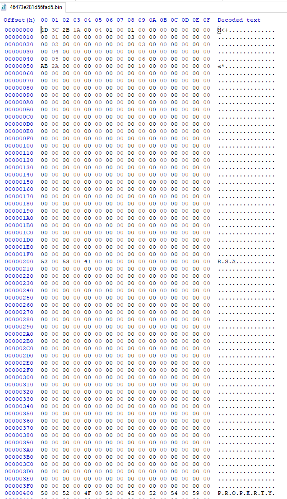

# Rewind vs world: CVE-2020-17087

I decided to check if ``rewind`` was able to find real world vulnerabilities. The main use case of ``rewind`` is to be able to trace or fuzz a function encountered during kernel driver security assessment.
So I need a vulnerability in a driver (in an ioctl would be perfect).

In November 2019, P0 releases some kind of 0-day in ```cng.sys`` (https://bugs.chromium.org/p/project-zero/issues/detail?id=2104)

> The Windows Kernel Cryptography Driver (cng.sys) exposes a \Device\CNG device to user-mode programs and supports a variety of IOCTLs with non-trivial input structures. It constitutes a locally accessible attack surface that can be exploited for privilege escalation (such as sandbox escape).
>
> We have identified a vulnerability in the processing of IOCTL 0x390400, reachable through the following series of calls:
>
> 1. cng!CngDispatch
> 2. cng!CngDeviceControl
> 3. cng!ConfigIoHandler_Safeguarded
> 4. cng!ConfigFunctionIoHandler
> 5. cng!_ConfigurationFunctionIoHandler
> 6. cng!BCryptSetContextFunctionProperty
> 7. cng!CfgAdtReportFunctionPropertyOperation
> 8. cng!CfgAdtpFormatPropertyBlock
>
> The bug resides in the cng!CfgAdtpFormatPropertyBlock function and is caused by a 16-bit integer truncation issue.


Another explanation is available on https://attackerkb.com/topics/y8mmBHc710/cve-2020-17087-windows-kernel-local-privilege-escalation-0day

> An error exists within cng!CfgAdtpFormatPropertyBlock where buffer is allocated from a value that is truncated to be 16-bits. The function then goes on and performs a binary to ASCII hex conversion, writing the ASCII hex characters to this buffer. While performing the conversion, the original buffer’s correct length is used causing the write to continue out of bounds.
>
> The vector for this vulnerability is local. A malicious attacker would first have to have code execution on the target system from any context including that of a sandboxed application. From there they would open a handle to \\.\GLOBALROOT\Device\Cng before issuing the 0x390400 IOCTL with a crafted input buffer. The crafted input buffer contains a size parameter as one of the fields that when set to 0x2aab or greater will trigger the overflow.
>
> Exploitation of this bug won’t be easy due to it being a heap based memory corruption within the kernel’s NonPagedPool. The attacker has partial control over the size of the allocation as constrained by ((size * 6) & 0xffff).

With these descriptions, this vulnerability seems like a good test case!

Explain rewind genesis
https://docs.microsoft.com/en-us/windows/win32/api/bcrypt/nf-bcrypt-bcryptsetcontextfunctionproperty

## Repro 

To reproduce the vulnerability I set up a vulnerable laptop and quickly write a rust executable (code available in the [cng] directory) to reproduce the bug.

```rust
let device = CString::new("\\\\.\\GLOBALROOT\\Device\\Cng").wrap_err("Failed to create cstring")?;
let h_cng = validate_handle(unsafe { 
    CreateFileA(device.as_ptr(),
        GENERIC_READ | GENERIC_WRITE,
        0,
        null_mut(),
        OPEN_EXISTING,
        0,
        null_mut())
}).wrap_err("Failed to open handle to \\\\Device\\Cng")?;

println!("opened \\Device\\Cng, handle: {:?}", h_cng);

let ioctl = 0x390400;

[snip]

println!("will send {:x} bytes to device", input.len());

let status = cvt(unsafe {
    DeviceIoControl(h_cng,
        ioctl,
        input.as_mut_ptr() as *mut _,
        input.len() as u32,
        output.as_mut_ptr() as *mut _,
        output.len() as u32,
        &mut bytes,
        null_mut())
});

println!("sent ioctl, result is {:x}", bytes);
println!("output: {:#x?}", &output);
```

With the inputs provided by P0 (I needed to modify them a bit, they are available in the [inputs] directory) and a kernel debugger, we quickly reproduce the bluescreen.



If you want to do the same, use the following command in windbg:

```
!reload
bp cng!ConfigIoHandler_safeguarded ".if (@rdx == 0n20000) {} .else {r rdx;g}"
bp cng!_ConfigurationFunctionIoHandler ".if (@rcx == 10400) {} .else {r rcx;g}"
```

Then launch the ``cng`` binary in a powershell session on the target system:

```
$ cng.exe --size 20000
```

The breakpoints should hit in windbg and you can use the pykd script to obtain a snapshot:
(pykd should be installed)

```
!load pykd
!py -g -3.7 [path_to_rewind]\Rewind\scripts\pykd_dump_context.py [path_to_snapshot]\snapshots
```

It's also best if you deactivate the swap and use only one cpu on the target system (you can use ``bcdedit /set onecpu on`` if you are not on a virtual machine).

If everything went well you will obtain a kernel memory dump:

```
Loading Dump File [C:\Projets\Rewind\examples\snapshots\19041.1.amd64fre.vb_release.191206-1406\cng\_ConfigurationFunctionIoHandler\mem.dmp]
Kernel Bitmap Dump File: Active memory is available


************* Path validation summary **************
Response                         Time (ms)     Location
Deferred                                       srv*
Symbol search path is: srv*
Executable search path is: 
Windows 10 Kernel Version 19041 UP Free x64
Product: WinNt, suite: TerminalServer SingleUserTS
Edition build lab: 19041.1.amd64fre.vb_release.191206-1406
Machine Name:
Kernel base = 0xfffff804`80400000 PsLoadedModuleList = 0xfffff804`8102a310
Debug session time: Tue Dec  1 16:09:45.766 2020 (UTC + 2:00)
System Uptime: 0 days 0:03:43.461
Loading Kernel Symbols
...............................................................
................................................................
...................................
Loading User Symbols
............
Loading unloaded module list
..........
For analysis of this file, run !analyze -v
cng!_ConfigurationFunctionIoHandler:
fffff804`83037f54 488bc4          mov     rax,rsp

kd> vertarget
Windows 10 Kernel Version 19041 UP Free x64
Product: WinNt, suite: TerminalServer SingleUserTS
Edition build lab: 19041.1.amd64fre.vb_release.191206-1406
Machine Name:
Kernel base = 0xfffff804`80400000 PsLoadedModuleList = 0xfffff804`8102a310
Debug session time: Tue Dec  1 16:09:45.766 2020 (UTC + 2:00)
System Uptime: 0 days 0:03:43.461
```

# Play with trace

If you don't want to use your own snapshots you can use the ones provided in the [snapshots] directory.
They only contains the memory pages needed to execute the tutorial (and thus might be not suitable for everything)

These snapshots are composed of several files:

```
❯ lsd .\snapshots\vuln\
context.json
mem
params.json
```

- ``context.json`` contains the initial state of the virtual cpu
- ``params.json`` contains the parameters used by the tracer (to know when to stop execution for example)
- ```mem`` is a directory where every physical pages are stored in a file

See what happens when we run tracer with context from snapshot:

```
❯ rewind trace run .\snapshots\vuln\
:: Running tracer
==> loading snapshot
==> will use bochs backend
==> setting tracer initial state
rax=0000000000000382 rbx=0000000000000000 rcx=ffffe38f3f699000
rdx=0000000000004e20 rsi=ffffe38f3f699000 rdi=ffffde0b7d3417f8
rip=fffff8051b28642c rsp=ffffde0b7d3416d8 rbp=ffffde0b7d341759
 r8=ffffe38f3f699000  r9=ffffde0b7d3417f8 r10=0000fffff8051b28
r11=ffffa67acee00000 r12=00000000c00000bb r13=0000000000390400
r14=0000000000000004 r15=0000000000000000
cs=0010  ss=0018  ds=002b  es=002b  fs=0053  gs=002b  rflags=0246
==> running tracer
==> executed 14172 instruction(s) in 35.3831ms (Success)
==> seen 3177 unique address(es)
==> mapped 130 page(s) (532.48 kB)
==> 45 page(s) were modified
```

We can use another backend (for example WHVP):

```
❯ rewind trace run .\snapshots\vuln\ --backend whvp
:: Running tracer
==> loading snapshot
==> will use whvp backend
==> setting tracer initial state
rax=0000000000000382 rbx=0000000000000000 rcx=ffffe38f3f699000
rdx=0000000000004e20 rsi=ffffe38f3f699000 rdi=ffffde0b7d3417f8
rip=fffff8051b28642c rsp=ffffde0b7d3416d8 rbp=ffffde0b7d341759
 r8=ffffe38f3f699000  r9=ffffde0b7d3417f8 r10=0000fffff8051b28
r11=ffffa67acee00000 r12=00000000c00000bb r13=0000000000390400
r14=0000000000000004 r15=0000000000000000
cs=0010  ss=0018  ds=002b  es=002b  fs=0053  gs=002b  rflags=0246
==> running tracer
==> executed 1 instruction(s) in 19.8264ms (Success)
==> seen 1 unique address(es)
==> mapped 130 page(s) (532.48 kB)
==> 56 page(s) were modified
```

Since we didn't specify the type of coverage, it didn't trace anything.
As of now we have some discrepancies between the 2 backends regarding how modified pages are taken into account.
It's also the case for counting executed instructions.

Let's do some singlestepping:

```
❯ rewind trace run .\snapshots\vuln\ --backend whvp --coverage instrs
:: Running tracer
==> loading snapshot
==> will use whvp backend
==> setting tracer initial state
rax=0000000000000382 rbx=0000000000000000 rcx=ffffe38f3f699000
rdx=0000000000004e20 rsi=ffffe38f3f699000 rdi=ffffde0b7d3417f8
rip=fffff8051b28642c rsp=ffffde0b7d3416d8 rbp=ffffde0b7d341759
 r8=ffffe38f3f699000  r9=ffffde0b7d3417f8 r10=0000fffff8051b28
r11=ffffa67acee00000 r12=00000000c00000bb r13=0000000000390400
r14=0000000000000004 r15=0000000000000000
cs=0010  ss=0018  ds=002b  es=002b  fs=0053  gs=002b  rflags=0246
==> running tracer
setting bp on return address fffff8051b285f5f
==> executed 34174 instruction(s) in 845.9993ms (Success)
==> seen 3176 unique address(es)
==> mapped 130 page(s) (532.48 kB)
==> 56 page(s) were modified
```

In singlestep, TF (Trap Flag) is enabled in ``rflags`` and we'll trap on exception. As a result a VM-exit will occur on every executed instruction.
It is really slow. Don't use WHVP backend to do tracing :)

We can also get the coverage on **new** encountered instructions. When executable pages are fetched from the snapshot, there are replaced with ``0xcc``. 
When the virtual cpu will execute an instruction, an exception will occur and be trapped by the hypervisor. We replace the ``0xcc`` with the original instruction read from the snapshot and resume execution.
As a result we can gather the number of **unique** executed addresses.

```
❯ rewind trace run .\snapshots\vuln\ --backend whvp --coverage hit
:: Running tracer
==> loading snapshot
==> will use whvp backend
==> setting tracer initial state
rax=0000000000000382 rbx=0000000000000000 rcx=ffffe38f3f699000
rdx=0000000000004e20 rsi=ffffe38f3f699000 rdi=ffffde0b7d3417f8
rip=fffff8051b28642c rsp=ffffde0b7d3416d8 rbp=ffffde0b7d341759
 r8=ffffe38f3f699000  r9=ffffde0b7d3417f8 r10=0000fffff8051b28
r11=ffffa67acee00000 r12=00000000c00000bb r13=0000000000390400
r14=0000000000000004 r15=0000000000000000
cs=0010  ss=0018  ds=002b  es=002b  fs=0053  gs=002b  rflags=0246
==> running tracer
==> executed 3176 instruction(s) in 771.0458ms (Success)
==> seen 3176 unique address(es)
==> mapped 130 page(s) (532.48 kB)
==> 56 page(s) were modified
```

Let's try to execute the vulnerable function with the input highlighted in the Google P0 report.
The input buffer is located in the ``rcx`` register and the input buffer size in ``rdx``.

```
❯ rewind trace run .\snapshots\vuln\ --backend bochs --input-address ffffe38f3f699000 --input-data .\inputs\P0_repro.bin
:: Running tracer
==> loading snapshot
==> will use bochs backend
==> setting tracer initial state
rax=0000000000000382 rbx=0000000000000000 rcx=ffffe38f3f699000
rdx=0000000000004e20 rsi=ffffe38f3f699000 rdi=ffffde0b7d3417f8
rip=fffff8051b28642c rsp=ffffde0b7d3416d8 rbp=ffffde0b7d341759
 r8=ffffe38f3f699000  r9=ffffde0b7d3417f8 r10=0000fffff8051b28
r11=ffffa67acee00000 r12=00000000c00000bb r13=0000000000390400
r14=0000000000000004 r15=0000000000000000
cs=0010  ss=0018  ds=002b  es=002b  fs=0053  gs=002b  rflags=0246
==> replaying input ".\\inputs\\P0_repro.bin"
==> writing input to ffffe38f3f699000
==> running tracer
==> executed 294269 instruction(s) in 269.7622ms (ForbiddenAddress("found excluded address nt!KeBugCheckEx"))
==> seen 14095 unique address(es)
==> mapped 411 page(s) (1.68 MB)
==> 108 page(s) were modified
```

The execution was stopped because we started to execute one of the forbidden functions (```KeBugCheckEx`` in this case).

Let's save the trace in order to understand what's going on:

```
❯ rewind trace run .\snapshots\vuln\ --backend bochs --input-address ffffe38f3f699000 --input-data .\inputs\P0_repro.bin --save-trace trace.json --save-context
...
==> saving trace to trace.json
```

The executed addresses (plus the processor context) are serialized to a JSON file.
Let's convert this trace to a more human friendly format.
To do this we need to specify the snapshot, the trace and a store. This store will be used to download binaries and symbols (if they are present on MS symbol server). It allows to symbolize the executed addresses. 

```
❯ rewind trace inspect --snapshot .\snapshots\vuln\ --trace .\trace.json --store ..\store\ --show-coverage
:: Inspecting trace
==> loading snapshot
==> loading trace
==> trace contains 294269 instructions

:: Analysing trace
==> loading modules
==> parsing trace
load hal.dll
donwload pe
download pe... ok
download pdb
download pdb... ok
load ntoskrnl.exe
donwload pe
download pe... ok
download pdb
download pdb... ok
load cng.sys
donwload pe
download pe... ok
download pdb
download pdb... ok
load WdFilter.sys
donwload pe
download pdb
==> trace has 4 modules(s) and 234 function(s)
==> displaying coverage
cng!AlgorithmCheck: 119 instructions
cng!BCryptAlloc: 16 instructions
cng!BCryptFree: 17 instructions
cng!BCryptSetContextFunctionProperty: 110 instructions
cng!CfgAdtReportFunctionPropertyOperation: 181 instructions
cng!CfgAdtpAppendSecuritySubjectInfo: 24 instructions
cng!CfgAdtpFormatPropertyBlock: 62 instructions
cng!CfgAdtpInitializeParameters: 19 instructions
cng!CfgReg_Acquire: 37 instructions
cng!ConfigIoHandler_Safeguarded: 86 instructions
cng!DataBlock_FreeBuffer: 11 instructions
cng!IoUnpack_SG_Buffer: 48 instructions
cng!IoUnpack_SG_Configuration_ParamBlock: 233 instructions
cng!IoUnpack_SG_ContextFunctionConfig: 42 instructions
cng!IoUnpack_SG_ParamBlock_Header: 37 instructions
cng!IoUnpack_SG_SzString: 96 instructions
cng!KeRegOpenKey: 43 instructions
cng!SzString_CchLength: 40 instructions
cng!ValidateInterfaceId: 8 instructions
cng!ValidateTableId: 5 instructions
cng!VerifyRegistryAccess: 16 instructions
cng!WinErrorToNtStatus: 16 instructions
cng!_ConfigFunctionIoHandler: 15 instructions
cng!_ConfigurationFunctionIoHandler: 82 instructions
cng!_NewLocalMachineKeyNameString: 49 instructions
cng!__security_check_cookie: 6 instructions
[...]
```

We clearly executed the vulnerable function (``cng!CfgAdtReportFunctionPropertyOperation``)

Let's save the executed instructions to a file to have a more closer look at what happened (it's a good time to have a coffee, it can be quite long)

```
❯ rewind-cng trace inspect --snapshot .\snapshots\vuln\ --trace .\trace.json --store ..\store\ --show-instructions --out .\trace.txt
:: Inspecting trace
==> loading snapshot
==> loading trace
==> trace contains 294269 instructions

:: Analysing trace
==> loading modules
==> parsing trace
[...]
```

If we look at the generated file and search what cause the bugcheck, we quickly find that the last thing executed by ``cng`` is a call to ``ExFreePoolWithTag``

```
instruction #284984:
rax=0000000000000001 rbx=ffffe38f3f2d7000 rcx=ffffe38f3f2d7000
rdx=0000000062676e43 rsi=0000000000000004 rdi=ffffe38f3f699008
rip=fffff8051b2865b2 rsp=ffffde0b7d341640 rbp=0000000000000004
 r8=ffffe38f3da08ed8  r9=0000000000000000 r10=fffff8051a3e9c80
r11=ffffde0b7d341610 r12=ffffe38f3f5eb000 r13=ffffde0b7d3417f8
r14=ffffe38f3f699000 r15=ffffe38f3f2d7000
rflags=0246
cng!BCryptFree+0x2e
fffff8051b2865b2 e8c93616ff                      call 0xfffff8051a3e9c80
```

Something bad happened since a fault handler was executed:

```
instruction #285175:
rax=0000000000000018 rbx=ffffe38f3f2d7000 rcx=ffffe38f3641ed58
rdx=0000000000000008 rsi=ffffe38f3f2d7000 rdi=0000000000000000
rip=fffff8051a3ea4cf rsp=ffffde0b7d341510 rbp=0000000000000004
 r8=0000000000023290  r9=0000000000000008 r10=0000000000000000
r11=0000000000000fff r12=ffffe38f36402000 r13=3b740a3cc8965210
r14=0000000000004e20 r15=0000000000000200
rflags=0246
ntkrnlmp!ExFreePoolWithTag+0x84f
fffff8051a3ea4cf 7411                            jz 0xfffff8051a3ea4e2

instruction #285176:
rax=0000000000000018 rbx=ffffe38f3f2d7000 rcx=ffffe38f3641ed58
rdx=0000000000000008 rsi=ffffe38f3f2d7000 rdi=0000000000000000
rip=fffff8051a3cc780 rsp=ffffde0b7d3414e0 rbp=0000000000000004
 r8=0000000000023290  r9=0000000000000008 r10=0000000000000000
r11=0000000000000fff r12=ffffe38f36402000 r13=3b740a3cc8965210
r14=0000000000004e20 r15=0000000000000200
rflags=0046
ntkrnlmp!KiGeneralProtectionFaultShadow
fffff8051a3cc780 f644241001                      test byte ptr [rsp+0x10], 0x01
```

The faulty instruction dereferences something pointed by ``r13`` and ``r13```is clearly not a canonical address (thus the general protection fault).

```
kd> u 0xfffff8051a3ea4e2
nt!ExFreePoolWithTag+0x862:
fffff805`1a3ea4e2 498b4d28        mov     rcx,qword ptr [r13+28h]
```

If we go back, it's clear that the pool was corrupted and the corruption is detected because of pointers xoring in the implementation of the kernel pool.

```
instruction #285029:
rax=0000000000000000 rbx=fffff8051a09f000 rcx=0000000000000000
rdx=0000000062676e43 rsi=ffffe38f3f2d7000 rdi=0000000000000000
rip=fffff8051a3e9db0 rsp=ffffde0b7d341510 rbp=0000000000000004
 r8=ffffe38f3da08ed8  r9=0000000000000000 r10=fffff8051a3e9c80
r11=ffffde0b7d341610 r12=ffffe38f3f5eb000 r13=ffcfe3bf3f000030
r14=ffff800000000000 r15=a2e64eada2e64ead
rflags=0246
ntkrnlmp!ExFreePoolWithTag+0x130
fffff8051a3e9db0 4c332d49430c00                  xor r13, [0xfffff8051a4ae100]
instruction #285030:
rax=0000000000000000 rbx=fffff8051a09f000 rcx=0000000000000000
rdx=0000000062676e43 rsi=ffffe38f3f2d7000 rdi=0000000000000000
rip=fffff8051a3e9db7 rsp=ffffde0b7d341510 rbp=0000000000000004
 r8=ffffe38f3da08ed8  r9=0000000000000000 r10=fffff8051a3e9c80
r11=ffffde0b7d341610 r12=ffffe38f3f5eb000 r13=999244916a701dbd
r14=ffff800000000000 r15=a2e64eada2e64ead
rflags=0246
ntkrnlmp!ExFreePoolWithTag+0x137
fffff8051a3e9db7 4d33ef                          xor r13, r15
```

FIXME: explain why no bluescreen ?
explain how to do a dummy sanitizer
explain that we could have use driver verifier too but don't want to modify the target

To ease with reversing and symbols, a local store is used and has the following structure:

```
❯ tree store
store
├── binaries
│   ├── cng.sys
│   │   ├── 2482C10CB7000
│   │   │   └── cng.sys
│   │   └── A7D172D6B7000
│   │       ├── cng.sys
│   ├── hal.dll
│   │   └── F8B4C72E9C000
│   │       └── hal.dll
│   └── ntoskrnl.exe
│       ├── 6105701FA71000
│       │   ├── ntoskrnl.exe
│       └── 90EE290B1046000
│           └── ntoskrnl.exe
└── symbols
    ├── cng.pdb
    │   ├── 48859d06bf92471e702abbc952f1c8ec1
    │   │   └── cng.pdb
    │   └── 86b63eb98ed873ddcb7654ac95c8c3ed1
    │       └── cng.pdb
    ├── hal.pdb
    │   └── 807db9487e66a225f419f924f4f06eaf1
    │       └── hal.pdb
    └── ntkrnlmp.pdb
        ├── 20c711bbd4c21aa5c45bc774bc7e04721
        │   └── ntkrnlmp.pdb
        └── b16053724b46515388fdea9d0470d02e1
            └── ntkrnlmp.pdb

18 directories, 17 files
```

# Let's do some fuzzing

We saw how we can quickly reproduce what was described in the P0 bug report. Now what if we forget about the root cause and what do discover this bug by fuzzing?

The first thing to do is do setup the fuzzer workdir. We need to specify the snapshot and the location of the controlled input.

```
❯ rewind fuzz init workdir --snapshot .\snapshots\vuln\ --input-address ffffe38f3f699000 --input-size 1000
:: Init fuzzer
==> checking parameters
==> checking snapshot
==> writing params
```

In this case we will fuzz the first 0x1000 bytes of the ioctl buffer

Then we can launch an arbitrary number of fuzzing instances using the available backends
We need to specify the layout of the input and the mutation we want

FIXME: rename description to mutation

A lot of things seems moved. Input is empty and 40 pages were modified. Snapshot restoration will be slow.
We need to go deeper.

When I told you that whvp was slower. Notice that the number of pages modified are different and the number of unique addresses too


W
in this part start fuzzing campaign
explain the mutator
explain the coverage
why we accept to lose some coverage precision
explain how we cycle with our corpus
explain how we leverage bochs to have some memory filtering and cmp instrumentation

show ida image to see that it's better to do a snapshot one function lower
redo snapshot
relaunch fuzzer

launch the monitor
launch a fuzzer with bochs
use edge coverage with bochs

show the differences in speed
explain why the speed decrease after a while
show coverage
coverage greatly increased but we start to see a lot of allocation and snapshot restore is slow

explain why whvp fuzzer encounters crashes not reproducible by bochs
show ida image

explain why after a while fuzzer is stopped

change mutation strategy
show msdn documentation
show dummy structured fuzzer

relaunch fuzzers
found the vuln

# 

in this part conclusion and next steps
the compromise is taking a toll
need better coverage
whvp is not adapted to do that
need to experiment with kvm
need to experiment with ipt
need to experiment with qbdi
explain the challenge

#

bonus part
explain how triton can be used
show script output
